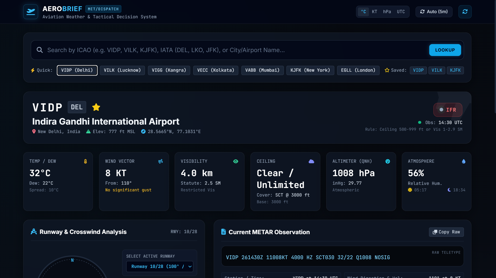
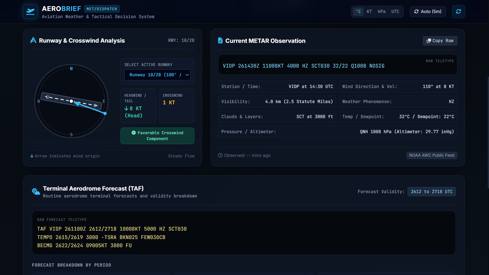
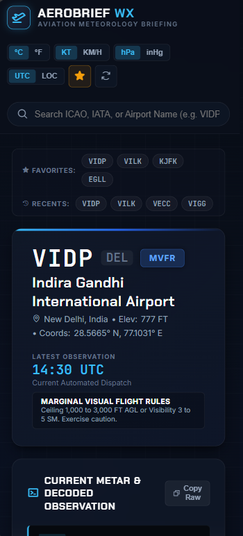

# ✈️ Aviation Weather Dashboard

A modern web-based aviation weather dashboard for viewing airport weather conditions, METAR reports, TAF forecasts, and aviation-specific weather information.

Built as a personal portfolio project to combine my interests in **aviation, technology, and software development**.

---

## 📸 Preview

### Main Dashboard



### METAR & Weather Information



### Mobile View



---

## 🌦️ Features

### 🛫 Airport Search

Search for airports using:

* ICAO code
* IATA code
* Airport name

The dashboard displays airport information including location, codes, elevation, and coordinates.

### 🌤️ Current Aviation Weather

View the latest available weather information, including:

* Temperature
* Dew point
* Wind direction
* Wind speed
* Wind gusts
* Visibility
* Cloud coverage
* Cloud base
* Atmospheric pressure
* Observation time

### 📡 METAR

View the original raw METAR report along with a human-readable interpretation.

Example:

```text
VILK 261230Z 27008KT 6000 SCT020 31/24 Q1007
```

The dashboard breaks the report into understandable information such as wind, visibility, clouds, temperature, dew point, and pressure.

### 📋 TAF

When available, the dashboard displays:

* Raw TAF
* Forecast validity
* Wind
* Visibility
* Cloud conditions
* Significant weather
* Temporary conditions

A simplified interpretation is also provided.

### ✈️ Aviation Conditions

The dashboard provides informational aviation weather classifications such as:

* VFR
* MVFR
* IFR
* LIFR

These classifications are based on visibility and ceiling conditions.

### 💨 Wind Information

Wind information is displayed using:

* Direction
* Speed
* Gusts
* Visual direction indicator

### ⭐ Additional Features

Depending on the current implementation:

* Favorite airports
* Recent searches
* Unit conversion
* UTC/local time
* Copy METAR
* Automatic refresh
* Responsive design
* Loading states
* Error handling
* Local storage

---

## 🎨 Design

The interface is designed around a modern aviation/weather-operations aesthetic.

The design focuses on:

* Dark aviation-inspired UI
* Clean typography
* Glass-style dashboard cards
* Responsive layouts
* Clear weather information
* Minimal animations
* Desktop and mobile support

The goal was to create something that feels more like an **aviation briefing dashboard** than a traditional weather application.

---

## 🛠️ Technologies

* HTML5
* CSS3
* JavaScript
* REST APIs
* Local Storage
* Git & GitHub

---

## 📁 Project Structure

```text
aviation-weather-dashboard/
│
├── index.html
├── style.css
├── script.js
│
├── assets/
│   └── icons/
│
├── screenshots/
│
└── README.md
```

---

## 🚀 Running Locally

### 1. Clone the repository

```bash
git clone https://github.com/YOUR-USERNAME/aviation-weather-dashboard.git
```

### 2. Open the project

Navigate into the project directory:

```bash
cd aviation-weather-dashboard
```

### 3. Run the website

You can open `index.html` directly in your browser.

For the best development experience, use a local development server such as the **Live Server** extension in VS Code.

---

## 🌐 Data & API

The dashboard uses aviation/weather data obtained through its configured API/data source.

The application is designed to display available data without fabricating missing weather information.

### API considerations

Depending on the selected data provider:

* API keys may be required
* Requests may be rate-limited
* Some airports may have incomplete METAR/TAF coverage
* API availability may affect the dashboard

Check the project's JavaScript configuration for the current API/data source.

---

## 🧠 How It Works

The basic workflow is:

```text
User searches for airport
        ↓
Airport is identified
        ↓
Weather data is requested
        ↓
METAR / TAF data is received
        ↓
Raw aviation data is parsed
        ↓
Information is displayed
        ↓
User receives a readable aviation weather briefing
```

---

## 📌 Example Airports

Some airports that can be used for testing include:

| ICAO | Airport                                           | City    |
| ---- | ------------------------------------------------- | ------- |
| VIDP | Indira Gandhi International Airport               | Delhi   |
| VILK | Chaudhary Charan Singh International Airport      | Lucknow |
| VECC | Netaji Subhas Chandra Bose International Airport  | Kolkata |
| VABB | Chhatrapati Shivaji Maharaj International Airport | Mumbai  |

---

## 🔮 Future Improvements

Possible future additions include:

* 🗺️ Interactive airport map
* 🛩️ More detailed runway information
* 💨 Crosswind calculations
* 📊 Historical METAR charts
* 🌦️ Weather radar integration
* 🛰️ Satellite imagery
* 📱 Progressive Web App support
* 🔔 Severe weather alerts
* 🛫 Flight information integration
* 📈 Historical weather trends
* 🌐 Support for more aviation weather data sources

---

## ⚠️ Disclaimer

This project is intended for **educational and informational purposes only**.

The information displayed by this dashboard should not be used as a replacement for official aviation weather briefings, NOTAMs, ATC information, or other official operational sources.

Always use approved and authoritative aviation information for real-world flight operations.

---

## 👨‍💻 About the Project

This project was created as part of my personal exploration of **aviation, software development, weather systems, and technology**.

It combines my interest in aviation with practical programming and web-development skills.

---

## 📄 License

This project is available for educational and personal use.

If you use or modify this project, please provide appropriate attribution.
